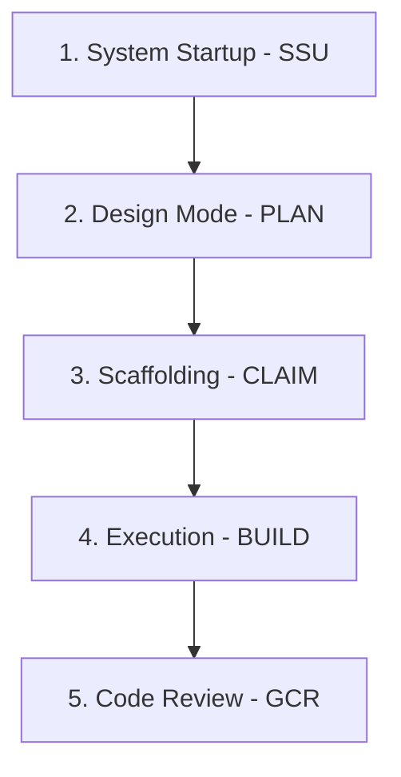

# 🌌 Agentic — Universal Agent Workflow Boilerplate

This repository contains the parameterized templates, rules, and procedures for running highly efficient agentic development loops. Designed to harmonize work between **Claude.ai** (Anthropic) and **Antigravity** (Google DeepMind) coding agents, it optimizes context sizes, enforces architectural constraints, and structures execution through rigid stage gating.

---

## 🚀 The Multi-Agent Workflow Cycle

To prevent context bloat and ensure reliable builds, development is split into five distinct, isolated phases:



### 1. ⚙️ System Startup (`SSU`)
At the start of **every** session, the agent runs the `SSU` sequence:
* **Connection Check:** Verifies active GitHub connection and fetches open PRs.
* **State Handoff:** Checks open PR descriptions for the `## Session State` block to identify in-flight progress, or locates the next `CLAIM`-completed ticket.
* **Brain Sync:** Antigravity checks the local brain path (`.gemini/antigravity/brain/<id>`) to load active planning artifacts.

### 2. 🧠 Read-Only Design (`PLAN`)
Before any code is altered, the agent processes tickets in a strictly **read-only** mode:
* **Precision DoDs:** Formulates specific, file-path-level checklists (Definition of Done).
* **Gotcha Auditing:** Matches planned work against known repository traps in `docs/ai/GOTCHAS.md`.
* **Verdict:** Ends with `READY` or `BLOCKED` (accompanied by exactly one clarifying question).

### 3. 🏗️ Ticket Scaffolding (`CLAIM`)
Translates a `READY` plan verdict into physical assets without modifying functional codebase files:
* **GitHub Issue:** Creates the issue, applying canonical labels (`feat`, `bug`, `chore`).
* **Canonical Naming:** Updates the title to the exact format `[YYMM-DEV-GH#] Description`.
* **Isolated Branch:** Spins up a target feature branch named `dev/[YYMM]-DEV-[GH#]`.

### 4. 🛠️ Development & Gating (`BUILD`)
With a ticket fully claimed, the agent begins file edits strictly within the feature branch under rigid architectural guidelines:
* **Authentication Gating:** protected routes must asynchronously gate on Clerk's `userId`. Bypass logic is forbidden.
* **Route Isolation:** All custom routing lives in `proxy.ts`. Creating a root `middleware.ts` is strictly prohibited.
* **Pattern A DB Helper Gating:** Supabase database access must only reference safe user-resolved SQL functions (`get_my_clerk_id()`, `get_my_profile_id()`).
* **390px Mobile-First & Dual Layouts:** Interfaces must render beautifully down to 390px. Developers must separate complex views into dedicated mobile and desktop layouts (Dual Layout Law).
* **Handoff Tracking:** PR descriptions must include the `## Session State` template specifying the active `Agent Type` and the next specific action step.

### 5. 🔍 Gemini Code Review (`GCR`)
Addresses feedback and revisions:
* The agent enters `GCR` mode to review pipeline outcomes or human comments.
* It implements fixes isolated to the active feature branch and updates the PR session block before handoff.

---

## 📂 Boilerplate Structure

* **`CLAUDE.md`**: The master directory config and entrypoint containing project variables, ID schemes, startup checks, and phase mappings.
* **`docs/ai/`**: Stage-by-stage runbooks detailing input, execution rules, and outputs for `PLAN`, `CLAIM`, `BUILD`, `GCR`, `GOTCHAS`, and `RULES`.
* **`.cursor/rules/`**: Target-specific MDC files (`auth.mdc`, `database.mdc`, `frontend.mdc`) providing automated, glob-filtered context injection for IDE extensions (Cursor, Windsurf).

---

## 🛠️ Bootstrapping a New Project

1. **Initialize Git & Link Remote:**
   ```powershell
   git init
   git remote add origin <your-github-repo-url>
   ```

2. **Copy Agent Assets:**
   Copy the `.cursor/` and `docs/` directories along with `CLAUDE.md` from this repository to your new project's root.

3. **Configure Project Constants:**
   Open the target `CLAUDE.md` and customize the variables at the top of the file:
   * `Repo`: Set your repository coordinate (e.g. `teamenjoyvd/new-app`).
   * `Supabase`: Set your database URL/ID.
   * `Prod URL`: Set your live production target URL.
